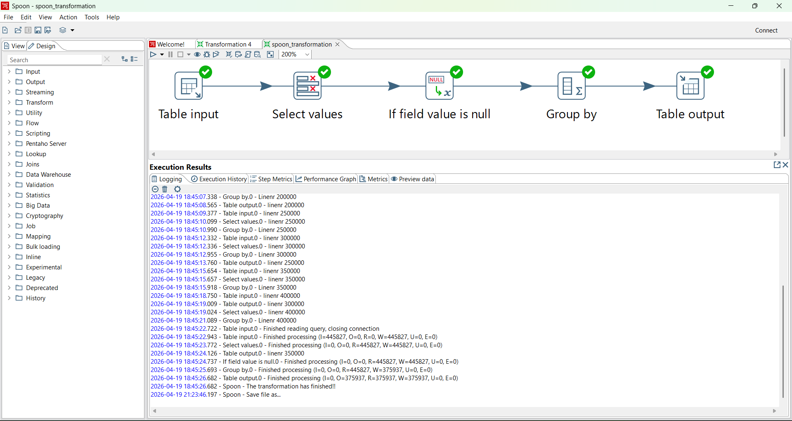
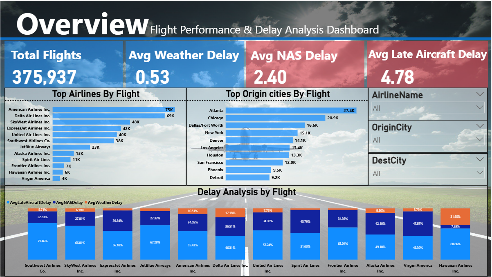
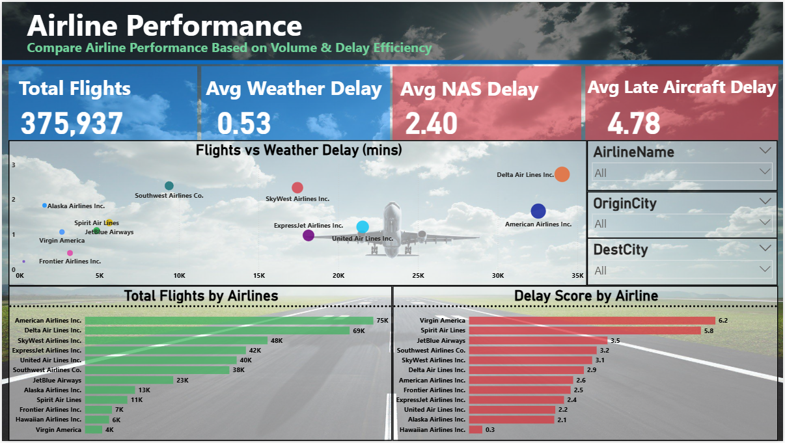
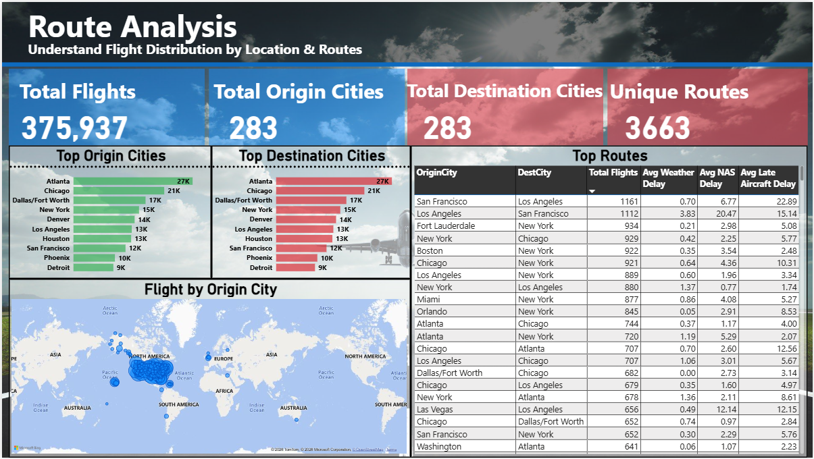
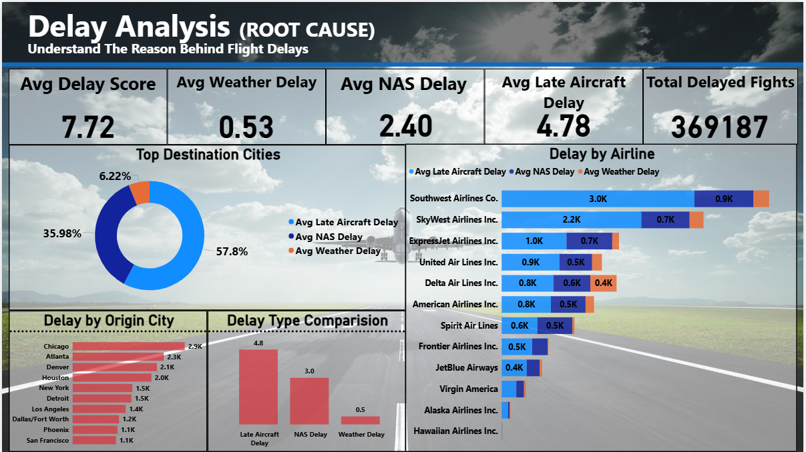

# ✈️ Flight Data Engineering Pipeline


-orange)


---

## 📌 Overview

This project demonstrates a complete **data engineering pipeline** for processing and analyzing large-scale flight data. The focus is on transforming raw, high-volume data into an optimized dataset suitable for business intelligence and visualization.

---

## 🏗️ Architecture

```text
MySQL Database → Spoon (ETL) → MySQL (Transformation) → SQL Views → Power BI
```

---

## 🔄 End-to-End Workflow

### 🔹 1. Data Extraction

* Data sourced from a MySQL database with restricted export access
* Small tables extracted manually
* Large dataset ingested directly using Spoon (Pentaho Data Integration)

---

### 🔹 2. Data Cleaning (Spoon)

* Removed **50–60 unnecessary columns**
* Selected only relevant fields:

  * Flight Date
  * Airline
  * Origin & Destination
  * Delay metrics
* Structured dataset for analytical use

📸 **Spoon Transformation Preview**



---

### 🔹 3. Data Transformation (MySQL)

* Initial dataset: ~445,000 rows
* Applied aggregation to optimize performance
* Final dataset: **6,324 rows**

```sql
GROUP BY year, month, uniquecarrier, origin, dest
```

---

### 🔹 4. Data Modeling

* Created dimension tables:

  * `dim_airline`
  * `dim_airport`
  * `dim_month`
  * `dim_date`
* Designed a **star-schema-like structure**

---

### 🔹 5. Analytical Layer (SQL Views)

* Created reusable SQL views:

  * Aggregated metrics
  * Joined descriptive attributes
* Final reporting view:

  * `vw_flight_analysis`

---

### 🔹 6. Visualization (Power BI)

* Built interactive dashboards focusing on:

  * Airline performance
  * Route analysis
  * Delay breakdown

---

## 📊 Dashboard Preview

### 🟦 Overview Dashboard



---

### 🟩 Airline Performance Dashboard



---

### 🟨 Route Analysis Dashboard



---

### 🟥 Delay Analysis Dashboard



---

## 📈 Key Insights

* Identified high-delay airlines and performance gaps
* Analyzed impact of Weather, NAS, and Late Aircraft delays
* Highlighted high-traffic and high-delay routes
* Compared airline efficiency using delay vs volume analysis

---

## 🚀 Tech Stack

* **Database:** MySQL
* **ETL Tool:** Spoon (Pentaho Data Integration)
* **Visualization:** Power BI

---

## 📁 Project Structure

```
flight-data-engineering-pipeline/
│
├── README.md
│
├── sql/
│   └── complete_data_pipeline.sql
│
├── etl/
│   └── spoon_transformation.ktr
│
├── powerbi/
│   └── dashboard.pbix
│
├── presentation/
│   └── flight_data_pipeline_presentation.pptx
│
├── images/
│   ├── overview.png
│   ├── airline_performance.png
│   ├── route_analysis.png
│   ├── delay_analysis.png
│   └── spoon_transformation.png
│
└── docs/
    ├── data_cleaning.md
    └── architecture.md
```

---

## 🔐 Data Access Note

The dataset was accessed from an external MySQL database with restricted permissions.
Credentials and direct access details are not included for security reasons.

---

## 💡 Key Learnings

* Handling large datasets under system constraints
* Designing efficient ETL pipelines
* Optimizing data for BI tools
* Building reusable analytical views
* Creating business-focused dashboards from raw data

---

## 🚀 Future Improvements

* Automate pipeline scheduling
* Implement incremental data loading
* Migrate pipeline to cloud platforms (AWS / Azure)
* Add predictive analytics for delay forecasting

---

## 👤 Author

Parth Sharma

---

## ⭐ If you found this project useful, consider giving it a star!
